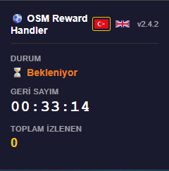
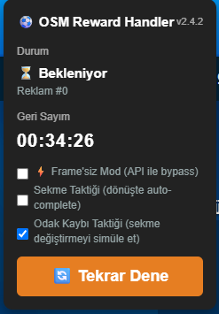

# ⚽ OSM Reward Handler



**English:** Online Soccer Manager Business Club ad reward automation.

**Türkçe:** Online Soccer Manager Business Club sayfasındaki reklam ödülü otomasyonu.

---

## Features / Özellikler

**English:**
- Three selectable modes (see below)
- Direct API reward flow (`start → watched → consumereward`) with live wallet update
- Automatic BusinessClub redirect on start
- Cooldown / ban management with persistent countdown timer
- In-game control panel + Chrome popup interface
- Turkish / English language support

**Türkçe:**
- Üç seçilebilir mod (aşağıya bakın)
- Doğrudan API ödül akışı (`start → watched → consumereward`) ve canlı cüzdan güncellemesi
- Başlatınca otomatik BusinessClub yönlendirmesi
- Cooldown / ban yönetimi ve kalıcı geri sayım
- Oyun içi kontrol paneli + Chrome popup arayüzü
- Türkçe / İngilizce dil desteği

---

## Modes / Modlar

**English:**
- **API bypass (recommended):** Runs the reward chain (`videos/start → videos/watched → consumereward`) directly through the API using the page's own Bearer token. No video is loaded; the Boss Coin balance is claimed instantly and the on-screen counter is refreshed via the page's own `updateWallet` (with animation), no page reload needed.
- **Modal focus-loss:** Opens the reward modal and closes it after an adjustable delay (panel slider, 0–3000 ms). Note: the ad preroll still plays in the background — the reward fires when it completes. Use API bypass if you want to skip ads entirely.
- **Normal:** Watches the full ad.

**Türkçe:**
- **API bypass (önerilen):** Ödül zincirini (`videos/start → videos/watched → consumereward`) sayfanın kendi Bearer token'ıyla doğrudan API üzerinden çalıştırır. Hiç video yüklenmez; Boss Coin bakiyesi anında claim edilir ve ekrandaki sayaç, sayfanın kendi `updateWallet` fonksiyonuyla (animasyonlu) F5 gerektirmeden güncellenir.
- **Modal odak kaybı:** Ödül modalını açıp ayarlanabilir bir gecikme sonrası kapatır (panel slider, 0–3000 ms). Not: reklam preroll'ü yine arkada oynar — ödül reklam bitince gelir. Reklamı tamamen atlamak istersen API bypass'ı kullan.
- **Normal:** Reklamı tam izler.

---

## Screenshots / Ekran Görüntüleri

| Popup UI (v2.4.2) | In-Game Panel (v2.4.2) |
|--------------------|------------------------|
|  |  |

---

## Installation / Kurulum

**English:**
1. Go to `chrome://extensions` in Chrome
2. Enable Developer mode
3. Click "Load unpacked" and select the project folder
4. Open OSM Business Club page

**Türkçe:**
1. Chrome'da `chrome://extensions` adresine gidin
2. Developer mode açın
3. "Load unpacked" ile proje klasörünü seçin
4. OSM Business Club sayfasını açın

---

## Usage / Kullanım

**English:**
1. Open the BusinessClub page (the bot redirects there automatically if needed)
2. On the top-left panel, tick a mode — **API bypass** is recommended
3. Click "▶ Start"; the bot runs the reward flow automatically
4. Click "⏸ Stop" to pause

**Türkçe:**
1. BusinessClub sayfasını açın (gerekirse bot otomatik yönlendirir)
2. Sol üstteki panelde bir mod seçin — **API bypass** önerilir
3. "▶ Başlat"a tıklayın; bot ödül akışını otomatik çalıştırır
4. "⏸ Durdur" ile durdurabilirsiniz

---

## Disclaimer / Sorumluluk Reddi

**English:** This software is for **educational and experimental purposes only**. It is not recommended to be used for activities that may violate OSM terms of service. The developer is not responsible for any account restrictions, bans, or other sanctions resulting from its use. The software is provided as-is, without any warranty.

**Türkçe:** Bu yazılım **eğitim ve deney amaçlıdır**. OSM hizmet şartlarını ihlal edebilecek faaliyetler için kullanılması tavsiye edilmez. Kullanımından doğabilecek hesap kısıtlamaları, yasaklamalar veya diğer yaptırımlardan yazılım geliştiricisi sorumlu değildir. Yazılım olduğu gibi sunulmaktadır, herhangi bir garanti verilmez.

---

## Project Structure / Proje Yapısı

```
├── manifest.json
├── background.js
├── _locales/
│   ├── en/messages.json
│   └── tr/messages.json
├── icons/
│   ├── icon.svg
│   ├── icon16.png
│   ├── icon32.png
│   ├── icon48.png
│   └── icon128.png
├── popup/
│   ├── popup.html
│   ├── popup.css
│   ├── popup.js
│   ├── i18n.js
│   └── flags/
│       ├── gb.svg
│       └── tr.svg
├── content/
│   ├── content.js
│   ├── i18n.js
│   ├── logger.js
│   ├── storage.js
│   ├── timer.js
│   ├── ui.js
│   └── automation.js
├── injected/
│   └── inject.js
├── iframe/
│   └── iframe-handler.js
├── styles/
│   └── panel.css
└── assets/
    ├── OSM_Reward_Handler_v2.4.2_Tool.png
    └── OSM_Reward_Handler_v2.4.2_UI.png
```

---

## License / Lisans

MIT
